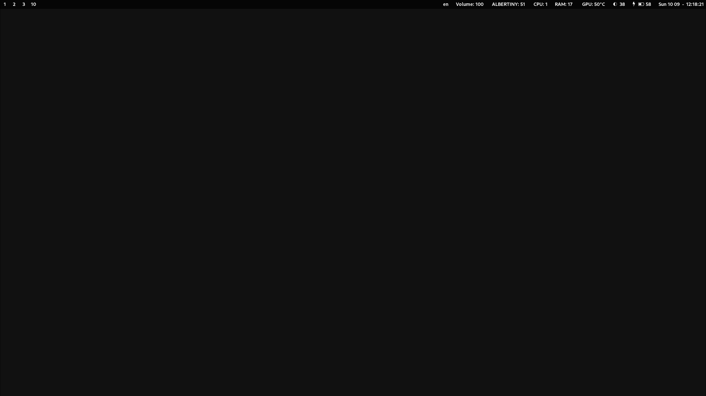
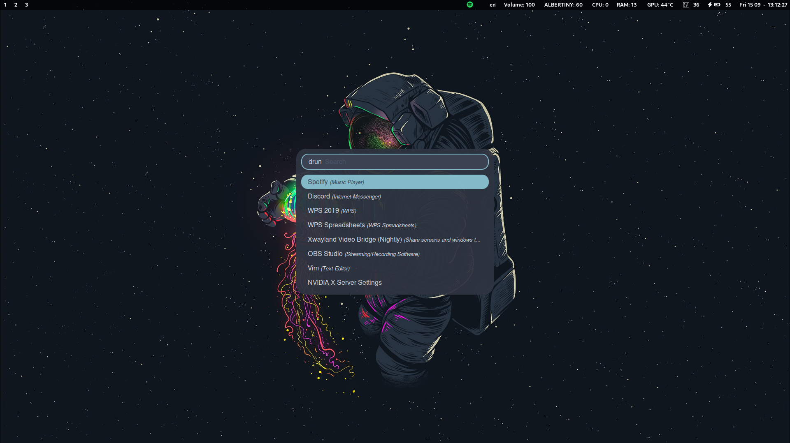
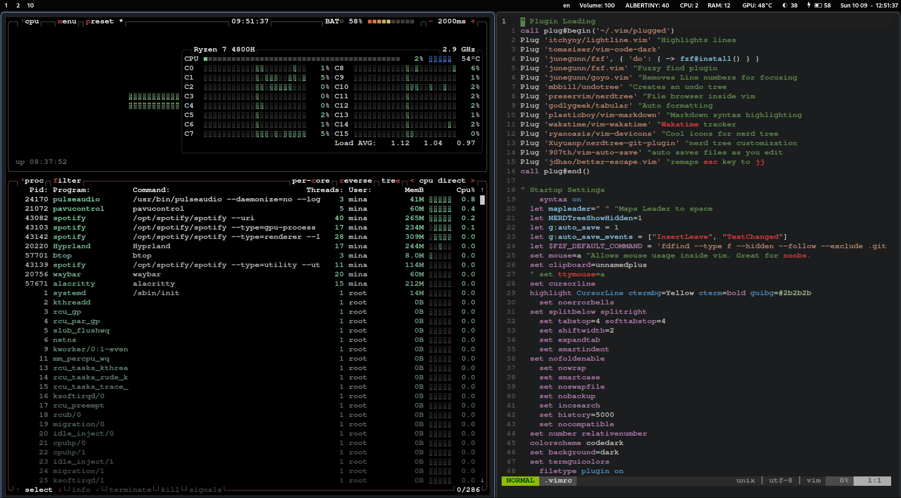
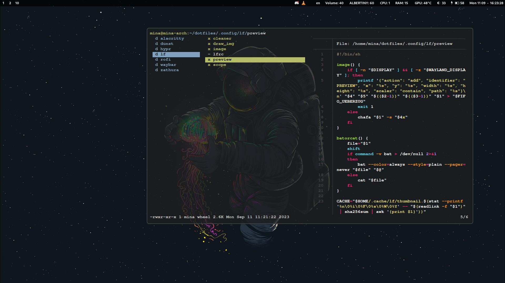

# Mina dotfiles

This is the configuration of my Arch linux System using Wayland

## Common Packages
- Window Manager & Compositor: hyprland
- Terminal: alacritty
- Editor: nvim, code (visual studio code)
- Image Viewer: sxiv
- Video Player: mpv, vlc
- Document Viewer: zathura (vim based)
- Zathura pdf plugin:  zathura-pdf-mupdf
- Font: ttf-jetbrains-mono-nerd
- Menu: rofi 
- Web Browser: brave-bin 
- Recording tool: wf-recorder
- Filemanager: lf, thunar
- Notification Daemon: dunst
- Status Bar: waybar
- Screenshots: hyprshot
- System Monitor: btop
- Wallpapers Manager: swaybg
- Clipboard Manager: copyq, xclip
- Backlight Controller: light
- Command line Translator: translate-shell

## Screenshots
- Desktop
  

- rofi menu 

- vim and btop

- lf 

<!---## Screenshots & Video -->

## NOTES:
- All the keybindings related to windows and other ones are located in .config/hypr/hyprland.conf
- This repository is not complete, you may face problems while using some of the dotfiles or scripts
- Some packages are in the official repositories and other from the AUR (Arch User Repository)

